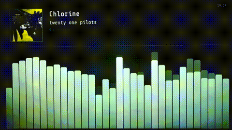

# Spectrum Analyzer

A Raspberry Pi-powered real-time audio spectrum analyzer with a vintage phosphor CRT aesthetic.

<!-- Replace with your own photo or GIF -->


## About

This project turns a Raspberry Pi and a small touchscreen into a real-time 32-band spectrum analyzer that looks like it belongs next to a reel-to-reel deck. It listens to your audio source, identifies songs via Shazam, and displays album art — all wrapped in a warm phosphor green CRT aesthetic. Built for the vinyl and HiFi setup where you want something beautiful reacting to the music.

## Features

- Real-time 32-band spectrum visualization
- Shazam-powered song identification with album art display
- Vintage phosphor green CRT aesthetic with glow and decay
- Idle clock mode with automatic audio detection
- Touchscreen controls for brightness, sensitivity, and mode switching
- Designed for Raspberry Pi — runs headless as a systemd service

## Hardware

- Raspberry Pi (3/4/5)
- USB audio interface (e.g. ClearClick, Behringer UCA202)
- Touchscreen display (800x480)
- Audio source — turntable, receiver, streaming amp, etc.

## Setup

```bash
# Clone the repo
git clone https://github.com/yourusername/spectrum-analyzer.git
cd spectrum-analyzer

# Install dependencies
sudo apt install python3-pyaudio
pip install shazamio requests numpy pygame

# Configure your audio device index and test mode
# Edit AUDIO_DEVICE_INDEX and TEST_MODE in hifi_display.py

# Run it
python3 hifi_display.py
```

To run on boot as a systemd service, create a unit file pointing to `hifi_display.py` and enable it.

## License

MIT
